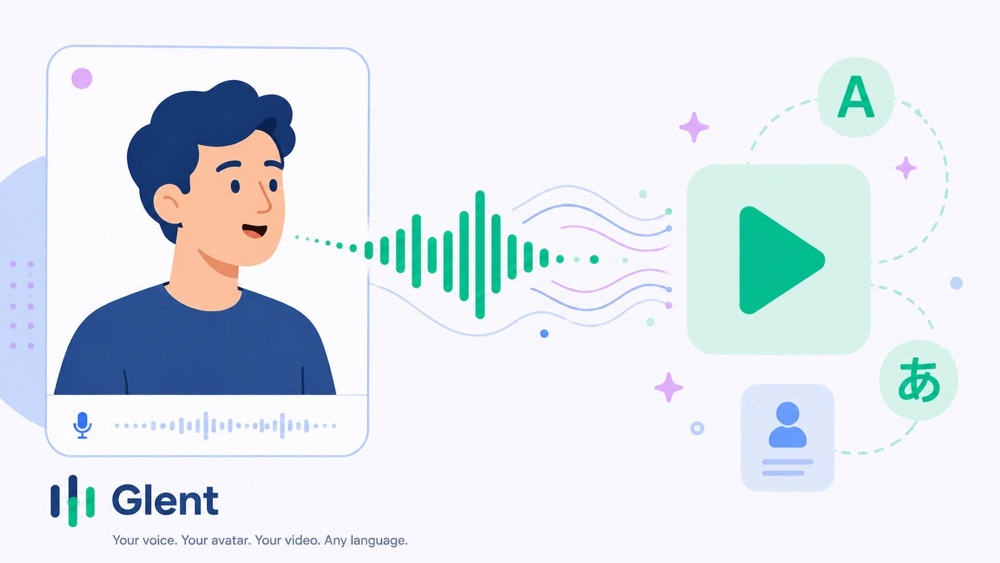
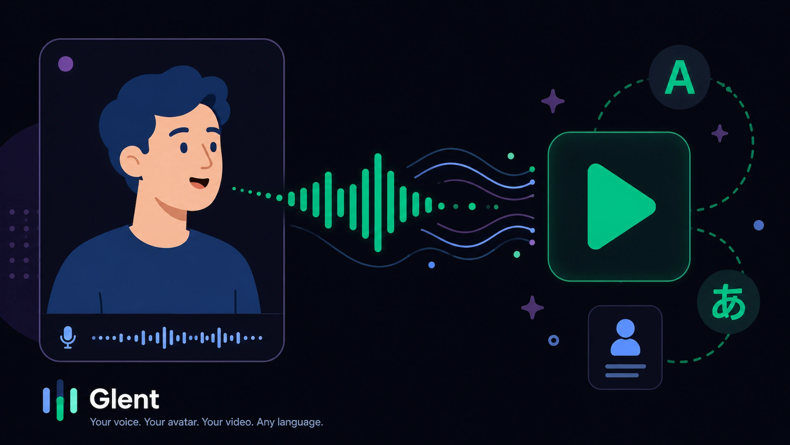

<p align="center">
  
</p>

<h1 align="center">Glent · AI Avatar Video & Voice Studio</h1>

<p align="center">
  <strong>Lip‑sync any portrait • Clone any voice • 23 languages</strong>
</p>

<p align="center">
  <a href="#-live-demo"></a>
  <a href="#-features"></a>
  <a href="#-tech-stack"></a>
  <a href="#-author"></a>
  <a href="#-license"></a>
</p>

<p align="center">
  
  
</p>

---

## ✨ What is Glent?

**Glent** (derived from _Glint_) is an AI‑powered creative studio that lets you generate **lip‑synced talking avatar videos** and **ultra‑realistic multilingual voiceovers** – all from a single photo and a short script. Powered by **Hallo3** and **ChatterboxTTS**, Glent runs on serverless GPU infrastructure (Modal) and keeps your creations private inside Cloudflare R2 buckets.

> **Portfolio Project** – built to demonstrate full‑stack AI integration, credit‑based payments, and real‑time job orchestration.

---

## 🔥 Features

| Category             | Highlights                                                                                                                                   |
| -------------------- | -------------------------------------------------------------------------------------------------------------------------------------------- |
| **Avatar Video**     | Animate any front‑facing portrait with speech from a script or your own audio. 150‑character limit, ~10 sec videos.                          |
| **AI Voice Studio**  | Generate speech in **23 languages** with fine‑grained controls: exaggeration, CFG weight, temperature, seed.                                 |
| **Voice Cloning**    | Upload a short `.wav` sample to clone any voice – captures timbre, accent, emotion.                                                          |
| **Credit System**    | 50 free credits on sign‑up. Buy Spark (500), Flare (1500), or Brilliance (3500) packs via Polar.sh. No subscriptions – credits never expire. |
| **Quota Limits**     | Portfolio mode: 1 avatar video / 7 days, 2 voiceovers / 24h. Keeps GPU costs manageable while letting everyone try everything.               |
| **Real‑time Status** | Live polling: `queued` → `tts_generating` → `video_generating` → `completed`.                                                                |
| **Private Storage**  | All assets (avatars, voice samples, renders) live in a private R2 bucket. Access via short‑lived presigned URLs.                             |
| **Cross‑platform**   | Fully responsive – works on desktop & mobile.                                                                                                |

---

## 🧠 How It Works

### Avatar Video Flow (script mode)

1. **Upload/Crop** a portrait photo (JPEG/PNG/WebP, ≤5MB).
2. **Write a script** (10–150 characters) and pick a voice from the library or upload a custom sample.
3. **Adjust settings** (language, exaggeration, CFG, temperature, seed).
4. **Generate** – Inngest triggers a Modal worker:
   - _TTS stage_: ChatterboxTTS synthesises speech → saves `.wav` in R2.
   - _Video stage_: Hallo3 animates the portrait using the generated audio → saves `.mp4`.
5. **Stream or download** the final video from your history.

### Voiceover Only Flow

- Similar but skips the video stage. TTS generates `.wav` directly.

> **Audio mode for Avatar Video** – upload a `.wav` instead of a script, and the TTS stage is bypassed entirely.

---

## 🏗️ Tech Stack

| Area             | Technology                                                               |
| ---------------- | ------------------------------------------------------------------------ |
| **Frontend**     | Next.js 15 (App Router), React 19, Tailwind CSS, shadcn/ui, Lucide icons |
| **Backend**      | Next.js API routes + Server Actions                                      |
| **Auth**         | Better‑Auth (email/password, multi‑session, Polar plugin)                |
| **Database**     | PostgreSQL + Prisma ORM                                                  |
| **Queue / Jobs** | Inngest (serverless durable execution)                                   |
| **AI Workers**   | Modal (GPU containers – T4 & A100‑80GB)                                  |
| **Storage**      | Cloudflare R2 (private bucket – presigned URLs)                          |
| **Payments**     | Polar.sh (checkout & webhooks for credit top‑ups)                        |
| **Email**        | Nodemailer (Gmail SMTP for verification)                                 |
| **Deployment**   | Vercel (web app) + Modal (workers)                                       |

---

## 🗂️ Project Structure (Tentative!)

```text
glent-hey-gen-clone/
├── web-app/                # Next.js T3 application
│   ├── src/
│   │   ├── app/            # App router pages & layouts
│   │   ├── components/     # React components (modals, dashboard, history, home)
│   │   ├── hooks/          # Custom hooks (quota, generation status, audio player)
│   │   ├── lib/            # Utils, constants, R2 upload helpers
│   │   ├── server/         # Server actions, Better‑Auth config, Inngest functions
│   │   └── styles/         # Global CSS with Tailwind & shadcn theme
│   ├── public/             # Static assets (favicon, hero illustrations)
│   └── package.json        # Dependencies & scripts
|   ├── .env                # Environment variables
|   ├── .env.example        # Environment variables template
│
├── modal-workers/          # Python Modal serverless GPU workers
│   ├── multilingual-tts/   # ChatterboxTTS worker
│   │   ├── tts.py
│   │   ├── utils.py
│   │   └── requirements.txt
│   ├── video-generation/   # Hallo3 worker
│   │   ├── video.py
│   │   └── requirements.txt
│   └── .env                # Modal secrets & R2 credentials
|   ├── .env.example        # Environment variables template
│
└── README.md               # The project readme
```

---

## 🚀 Live Demo

The production instance is deployed on **Vercel**:

👉 [**https://glent.vercel.app**](https://glent.vercel.app)

- Sign up with email (no credit card required for free tier).
- Receive 50 credits instantly.
- Start generating avatar videos or voiceovers.

> _Note:_ Because this is a portfolio demo, daily/weekly quotas are enforced to manage GPU costs. Upgrade to a credit pack for more generations.

---

## 📸 Screenshots

<p align="center">
  <strong>Light theme illustration</strong><br/>
  
</p>

<p align="center">
  <strong>Dark theme illustration</strong><br/>
  
</p>

---

## 🧪 Prerequisites

- **Node.js** 20+ & **pnpm** 10+
- **PostgreSQL** (local or remote, e.g., Neon.tech)
- **Cloudflare R2** account (or any S3‑compatible bucket)
- **Modal** account (for GPU workers)
- **Polar.sh** account (for payments & webhooks)
- **Gmail** (or any SMTP) for email verification
- **Inngest** account (optional for local dev; events run via Inngest dev server)

---

## 🔧 Environment Variables

Copy `.env.example` to `.env` in the `web-app/` folder and fill in the values:

```env
#Environment
NODE_ENV="development"

# App
NEXT_PUBLIC_APP_URL="http://localhost:3000"

# Database (PostgreSQL)
DATABASE_URL="postgresql://..."
DIRECT_URL="postgresql://..."

# Better‑Auth
BETTER_AUTH_SECRET="..."        # generate with `openssl rand -base64 32`
BETTER_AUTH_URL=http://localhost:3000

# Modal GPU Workers
MODAL_API_KEY="..."
MODAL_API_SECRET="..."
MODAL_MTL_TTS_API_URL="https://...modal.run/generate_speech"
MODAL_VIDEO_GEN_API_URL="https://...modal.run/generate_video"

# Cloudflare R2
R2_ACCOUNT_ID="..."
R2_ACCESS_KEY_ID="..."
R2_SECRET_ACCESS_KEY="..."
R2_PRIVATE_BUCKET=""
R2_PUBLIC_BUCKET=""
R2_PUBLIC_URL="https://pub-....r2.dev"

# Email (Gmail)
GMAIL_USER="your-email@gmail.com"
GMAIL_APP_PASSWORD="xxxx xxxx xxxx xxxx"

# Inngest (optional – for production)
INNGEST_EVENT_KEY="dummy_key_for_linting"
INNGEST_SIGNING_KEY="dummy_key_for_linting"

# Polar.sh
POLAR_ACCESS_TOKEN="..."
POLAR_WEBHOOK_SECRET="..."
```

---

## 🖥️ Local Development

### 1. Clone & install dependencies

```bash
git clone https://github.com/KeepSerene/glent-hey-gen-clone.git
cd glent-hey-gen-clone/web-app
pnpm install
```

### 2. Set up the database

```bash
pnpm db:push           # pushes schema to your PostgreSQL
pnpm db:studio         # (optional) opens Prisma Studio
```

### 3. Run the Next.js dev server

```bash
pnpm dev
```

Open [http://localhost:3000](http://localhost:3000) – you're ready to go!

### 4. Start the Inngest dev server (required for generation jobs)

```bash
pnpm inngest:dev
```

This runs the Inngest CLI locally, enabling your server actions to send events.

> **GPU Workers** – To actually generate videos/voiceovers, you need to deploy the Modal workers first (see next section). The local dev server will still queue jobs and poll status, but the actual inference requires the Modal endpoints.

---

## ☁️ Deploying Modal Workers

1. Install the [Modal CLI](https://modal.com/docs/reference/cli/install) and authenticate:

   ```bash
   pip install modal
   modal token set --token-id YOUR_TOKEN_ID --token-secret YOUR_TOKEN_SECRET
   ```

2. Navigate to `modal-workers/` and set up your `.env` file with the necessary R2 & Modal secrets.

3. Deploy the TTS worker:

   ```bash
   modal deploy -m multilingual-tts.tts
   ```

4. Deploy the Video worker:

   ```bash
   modal deploy video-generation/video.py
   ```

5. Copy the deployed endpoint URLs (e.g., `https://your-username--glent-mtl-tts-generate-speech.modal.run`) into your env vars.

> **Important**: The workers need access to your R2 bucket. The `glent-r2-secret` Modal secret must contain all required keys (`R2_ACCOUNT_ID`, `R2_ACCESS_KEY_ID`, `R2_SECRET_ACCESS_KEY`, `R2_PRIVATE_BUCKET`, plus AWS compat aliases). See `video.py` for the exact names.

---

## 🌐 Deployment on Vercel

1. Push your `web-app` folder to a GitHub repository.
2. Import the project on [Vercel](https://vercel.com/new).
3. Add all environment variables (the same ones from `.env`).
4. Set the **Build Command** to `pnpm build` and **Output Directory** to `.next`.
5. Deploy – Vercel will automatically run `prisma generate` and `next build`.

> Your Inngest functions will run in production using the `INNGEST_EVENT_KEY` and `INNGEST_SIGNING_KEY`. Don't forget to also set the `NEXT_PUBLIC_APP_URL` to your production URL.

---

## 🧪 Testing & Validation

- **Quotas**: The first avatar video and two voiceovers are free (within the 24h/7d windows). After that, you'll see a "Limit Reached" badge.
- **Credits**: Buy a pack on the Pricing page – the Polar webhook should instantly add credits to your user.
- **Cancellation**: Queued jobs can be cancelled for a full refund. Once a worker starts, no refund.
- **Dark mode**: The theme automatically follows your system preference, or you can toggle via the header button.

---

## 📦 Database Schema (Prisma)

Key models:

- `User` – holds `credits` (default 50).
- `AvatarVideo` – stores job parameters, statuses, and R2 keys for the avatar, audio, and final video.
- `Voiceover` – similar but only audio output.
- `GenerationEvent` – tracks quota usage (`type` + `createdAt`).

All R2 keys are stored as strings; presigned URLs are generated on the fly.

---

## 🤝 Contributing

This is a personal portfolio project, but issues and suggestions are welcome! Feel free to open an issue or a pull request.

1. Fork the repository.
2. Create your feature branch (`git checkout -b feature/amazing-idea`).
3. Commit your changes (`git commit -m 'Add some amazing feature'`).
4. Push to the branch (`git push origin feature/amazing-idea`).
5. Open a Pull Request.

---

## 👤 Author

**Dhrubajyoti Bhattacharjee**

- Portfolio: [math-to-dev.vercel.app](https://math-to-dev.vercel.app)
- GitHub: [@KeepSerene](https://github.com/KeepSerene)
- LinkedIn: [dhrubajyoti-bhattacharjee](https://www.linkedin.com/in/dhrubajyoti-bhattacharjee-320822318/)
- X (Twitter): [@UsualLearner](https://x.com/UsualLearner)

---

## 📄 License

This project is licensed under the **Apache 2.0 License** – see the [LICENSE](LICENSE) file for details.

---

## 🙏 Acknowledgements

- [Hallo3](https://github.com/fudan-generative-vision/hallo3) – stunning portrait animation model.
- [ChatterboxTTS](https://github.com/ridgerchu/chatterbox) – multi‑lingual text‑to‑speech.
- [Modal Labs](https://modal.com) – serverless GPU infrastructure.
- [Better‑Auth](https://better-auth.com) – flexible authentication.
- [Inngest](https://www.inngest.com) – durable job queues.
- [Cloudflare R2](https://developers.cloudflare.com/r2/) – affordable S3‑compatible storage.
- [Polar.sh](https://polar.sh) – no‑hassle payments for developers.
- [shadcn/ui](https://ui.shadcn.com) – beautiful, accessible components.

---

<p align="center">
  Made with 💧 and TypeScript.
  <br/>
  <a href="https://glent.vercel.app">Try Glent now →</a>
</p>
